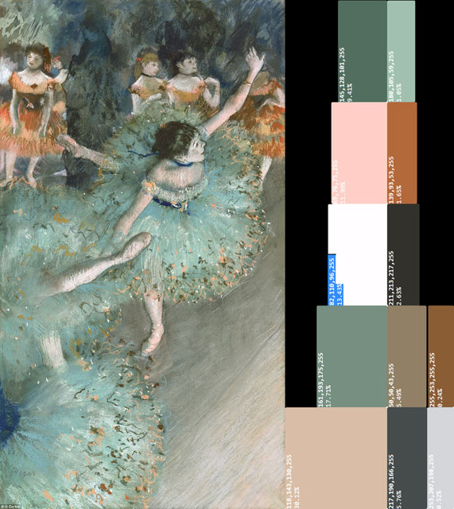
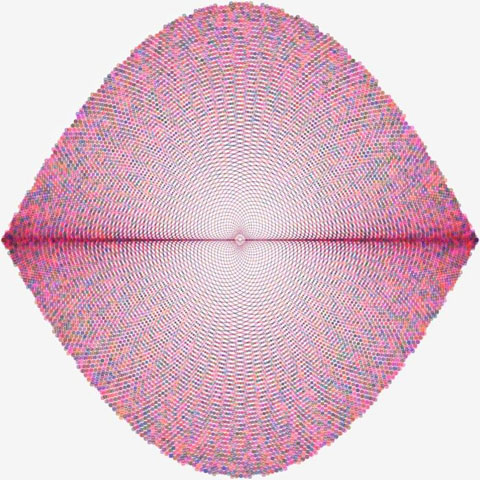

# **shauryashaurya**
## Web presence for **Shaurya Agarwal**
  
## About   
  
* [Github](https://github.com/shauryashaurya)
* [Linked In](https://www.linkedin.com/in/shauryashaurya/)
* [Instagram](https://www.instagram.com/shaurya.shaurya/) - photography, sketches etc.
* [Facebook](https://www.facebook.com/shauryashaurya) - social
  
  
## Open Source Initiatives  

  
  
### [Data Munging Using *X*](https://github.com/shauryashaurya/learn-data-munging#data-munging-using-x)
Data Engineering Workshops with Spark (PySpark), Pandas, Dask, Ray etc - some of the most popular libraries in the field. Supports Google Colab, click on the  badge next to each notebook's link.
  
### [Notebooks on Statistics and Machine Learning](https://github.com/shauryashaurya/Notes-on-Statistics-and-Machine-Learning-with-Python)   
These serve as practical notes and references on common machine learning algorithms with an introduction to Pandas and Numpy.      

### [Vogon Poetry](https://shauryashaurya.github.io/vogon-poetry/)
concepts like zero-copy-columnar-layout-distributed-vectorized etc. that sound like Vogon Poetry to data engineering teams trying to modernize their game...              

### [The Data Engineering Rocket Ship](https://shauryashaurya.github.io/rocket-ship/)
Long-form posts on data engineering and technology in collaboration with my team              
      
### [CoolRE](https://shauryashaurya.github.io/coolRE/)
Pronounced "cooler" provides 3 approaches to building a regular expressions engine - a toy overview, a backtracking based implementation and a finite-automata based approach.    
  
### [Kandinsky](https://shauryashaurya.github.io/kandinsky/)
Discover key colours in a painting or photograph using K-Means clustering. Also provides the proportions of the colours. Some results (more in the repo):    
  
  
    
  
    
  
    
  
    
  
### [Barnsley Fern Fractal](https://gist.github.com/shauryashaurya/257042e27df06f771f34bcc877b128cf)  
  
    
    
    
  
### [Phyllotaxis and L-systems example](https://gist.github.com/shauryashaurya/9ce3815ae7f95fd0d9997c5d882d10a4)  
  
    
    
    
  
## Certifications  
* [Deeplearning.ai + Coursera](https://www.coursera.org/account/accomplishments/specialization/certificate/3Q6YKY4FL893) - scored 100% across the board.
  * [Neural Networks and Deep Learning](https://coursera.org/share/6e6578079a897653f694e2b0aa29d9c3) 
  * [Structuring Machine Learning Projects](https://coursera.org/share/16748962ee3b2810bf474859c9663644)
  * [Convolutional Neural Networks](https://coursera.org/share/d924d509e6dcb5f99c9ec7bd2d59e9ca)
  * [Sequence Models](https://coursera.org/share/01d13b9030cbd126b7a14bc82281d04a)
  * [Improving Deep Neural Networks: Hyperparameter tuning, Regularization and Optimization](https://coursera.org/share/8500658682fc0106deef572092443159)
  
## Trainings Archive / Older Material  
* [Topics in JavaScript, using Jupyter Notebooks](https://github.com/shauryashaurya/Simplifying-Advanced-Topics-in-Javascript)
* [Building x.509 certificates for MongoDB](https://github.com/shauryashaurya/tutorial-x.509certificates-mongo) - was written originally to be used with MongoDB, may be outdated, see latest Mongo documentation. Still a good step-by-step on how to build a certificate.
* [DC/OS Training](https://shauryashaurya.github.io/DCOS-Training/) - no longer current, it's better to reference the DC/OS documentation.
  
## [A quick FinOps project with Notional Data](https://shauryashaurya.github.io/shauryashaurya/Sample-FinOps-Project/blob/main/Cost_Usage_Analysis_001.html)
